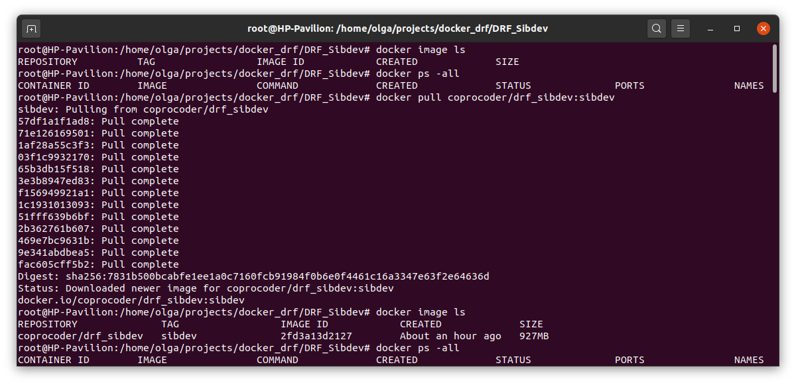
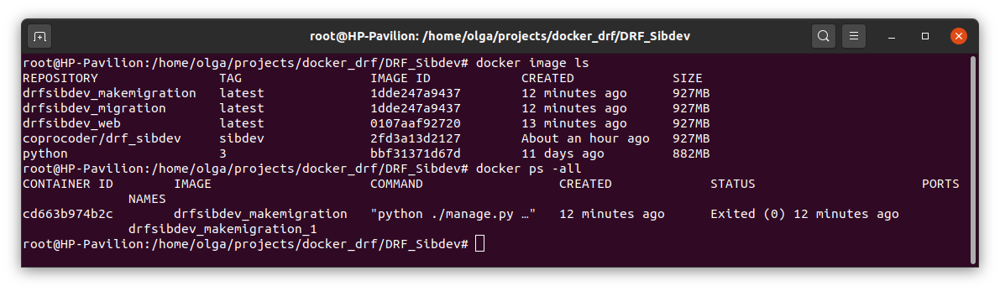
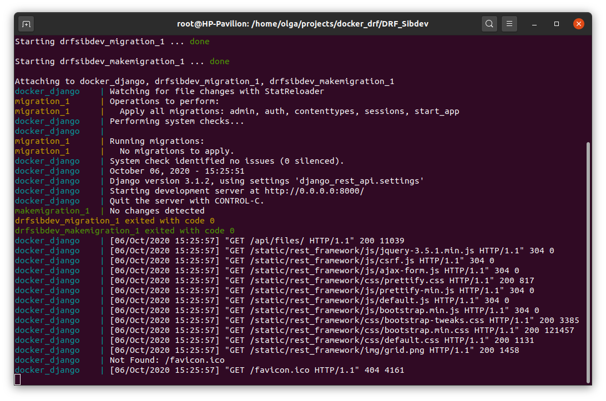
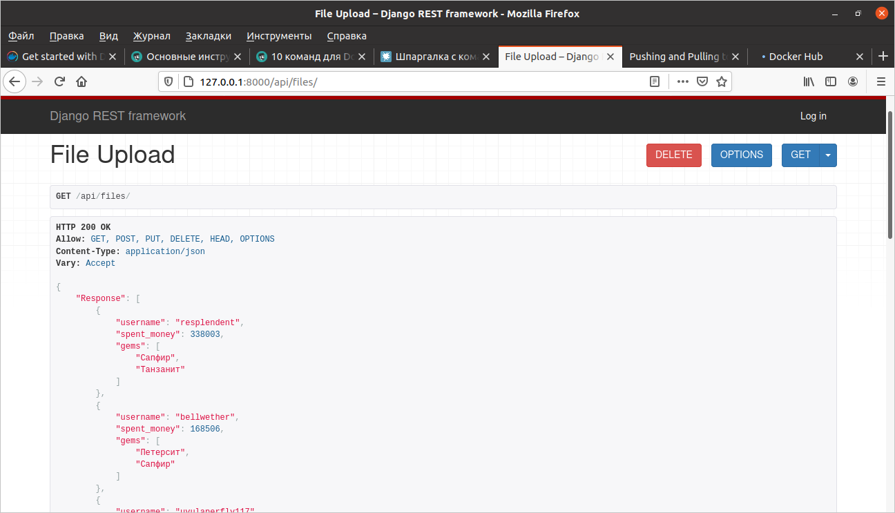

Django_rest_api example for SibDev
==================================

Description of project 

Prepare for Git
------------------
    $ git clone --branch master https://github.com/coprocoder/DRF_Sibdev.git 
    $ cd DRF_Sibdev
	$ pip install -r requirements.txt (only if you don't have Django 3.0 installed)
	$ python manage.py migrate
	$ python manage.py runserver

Prepare for Docker
------------------

>Download image from DockerHub:
 
    docker pull coprocoder/drf_sibdev:sibdev

>Create container and run it:

    docker-compose up

    
> Results:

URLs
------------------

 API
    
    http://127.0.0.1:8000/api/files/
 
 App GUI
    
    http://127.0.0.1:8000/admin/start_app/file/
    
Post
------------------
    
    curl -X POST -S -u "login:password" -F "file=@filepath" 127.0.0.1:8000/api/files/
    
For example:

> Request

    curl -X POST -S -u "admin:sibdev" -F "file=@C:\Users\ILYA\Desktop\Sibdev\deals.csv" 127.0.0.1:8000/api/files/
> Response

	[03/Oct/2020 23:01:06] "POST /api/files/ HTTP/1.1" 201 7

> Result

The uploaded file is now on the server. Document dir /media

Get
------------------

    curl -X GET -S -u "login:password" 127.0.0.1:8000/api/files/
    
For example:

> Request

    curl -X GET -S -u "admin:sibdev" 127.0.0.1:8000/api/files/

> Response

    "Response": [
        {
            "username": "resplendent",
            "spent_money": 338003,
            "gems": [
                "Сапфир",
                "Танзанит"
            ]
        },
        {
            "username": "bellwether",
            "spent_money": 168506,
            "gems": [
                "Петерсит",
                "Сапфир"
            ]
        },
        {
            "username": "uvulaperfly117",
            "spent_money": 110491,
            "gems": [
                "Аметрин",
                "Петерсит",
                "Танзанит"
            ]
        },
        {
            "username": "braggadocio",
            "spent_money": 93542,
            "gems": []
        },
        {
            "username": "kismetkings213",
            "spent_money": 78708,
            "gems": [
                "Сапфир",
                "Аметрин"
            ]
        }
    ]
    
Start settings for local project
------------------

Change detection: finds missing system elements

    python manage.py makemigrations
    
Apply change: restore missing system elements (Ex: DB tables)

    python manage.py migrate
    
Run server 

    python manage.py runserver